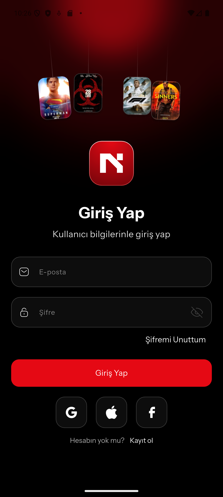
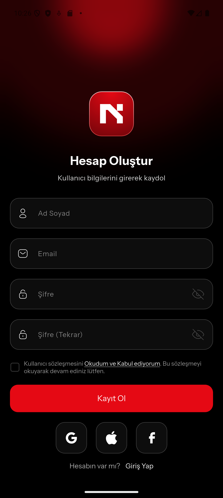
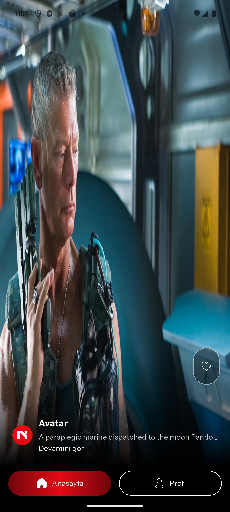
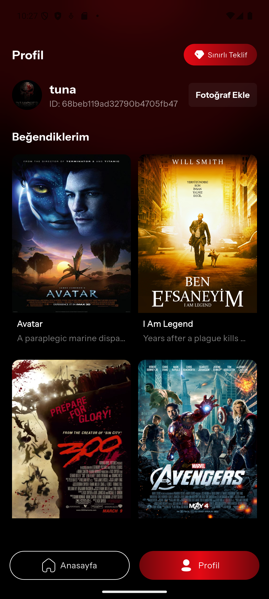
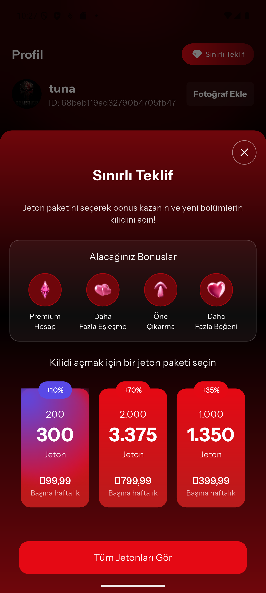
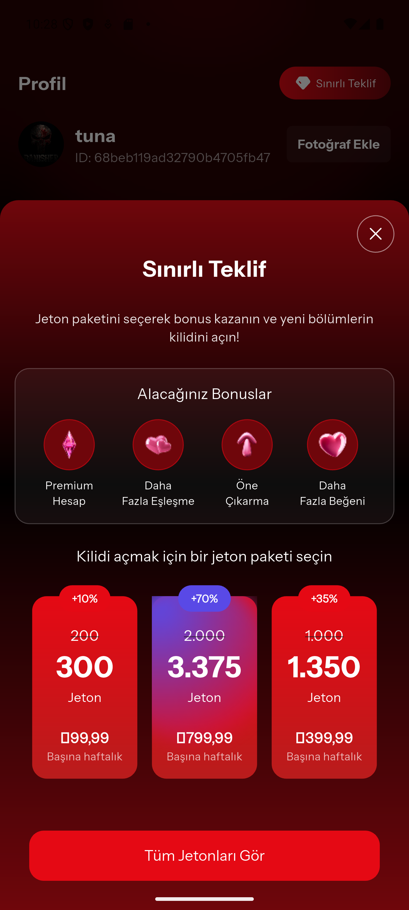
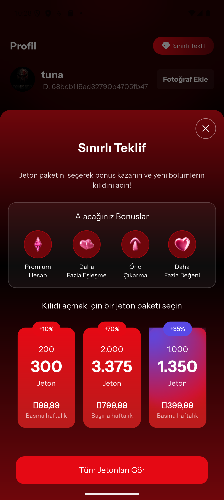
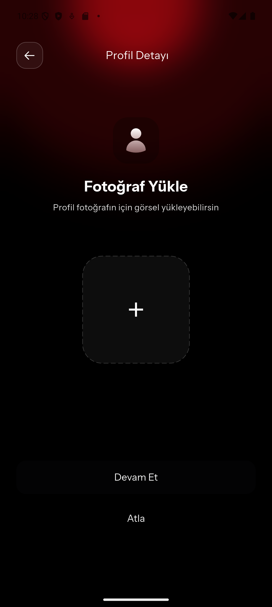
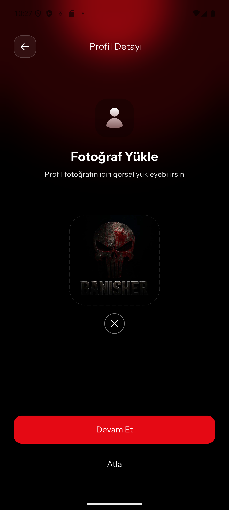

# 🚀 Kullanılan Teknolojiler ve Paketler

- **State Management:** Bloc Pattern, Cubit
- **Network:** dio
- **Repository-Service Pattern:** Tüm veri işlemleri için repository ve service katmanları
- **Test:** test,  (unit testleri)
- **Routing:** go_router
- **Widget:** Custom widget yapısı, özelleştirilmiş ortak widget'lar
- **Animasyon:** lottie
- **Görsel Yönetimi:** cached_network_image
- **Diğer:** Equatable, SharedPreferences (local storage), Lottie, SVG, AppColors, AppTextStyles

# Uygulama Görselleri

<table>
   <tr>
      <td></td>
      <td></td>
      <td></td>
   </tr>
   <tr>
      <td></td>
      <td></td>
      <td></td>
   </tr>
   <tr>
      <td></td>
      <td></td>
      <td></td>
   </tr>
     <tr>
      <td></td>
      <td></td>
-   </tr>
</table>

# Uygulama Tanıtım Videosu

[Tanıtım Videosunu YouTube'da İzle](https://youtube.com/shorts/jNN9LG2Y5eg)

